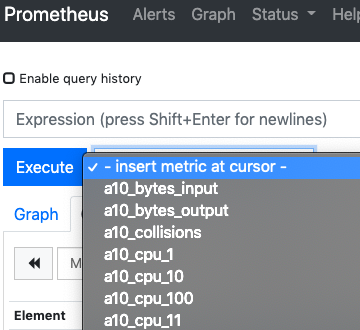

# A10 Thunder support of Prometheus

<br>
<br>
As of version 5.2.0, Thunder now has native support for [Prometheus](https://prometheus.io/).<br>
<br>
Prior versions of 4.x and 5.x can use the [Prometheus Exporter](https://github.com/a10networks/PrometheusExporter).<br>
<br>
## To use Thunder with Prometheus

Inside your *prometheus.yml* file, you will need a section like this under the *scrape_config*:

```yaml
scrape_configs:
  # Thunder Container
  - job_name: 'cthunder'
    scheme: "https"
    tls_config:
      insecure_skip_verify: true
    metrics_path: "/metrics"
    metric_relabel_configs:
      - source_labels: [__name__]
        target_label: __name__
        replacement: "a10_${1}"
    static_configs:
      - targets: ['172.17.0.4']
    params:
        api_endpoint: [
            "/slb/virtual-server/web-servers/port/80+tcp/stats",
            "/slb/virtual-server/web-servers/port/80+tcp/rates"    
        ]
        username: ["admin"]
        password: ["a10"]
```

The *api_endpoint* array can hold multiple endpoints for Prometheus to go collect. Virtual Servers are of the form:  /slb/virtual-server/{name}/port/{port number}+{IP type}[/stats|/rates]<br>
<br>
The *metric_relable_configs* section should be added to prefix and identifier for the A10 Thunder device being scraped...otherwise it will be difficult to pick out which metric belongs to which device.